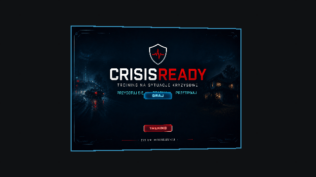
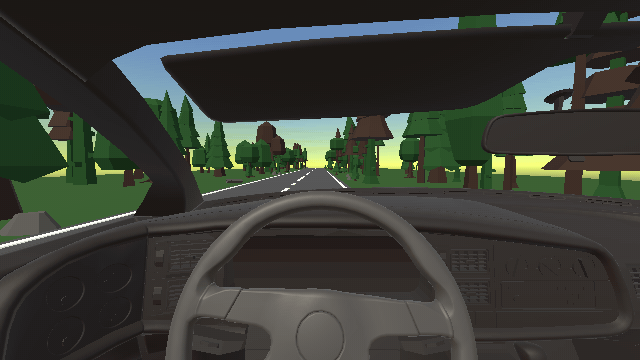
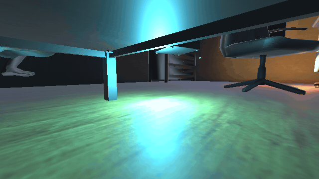
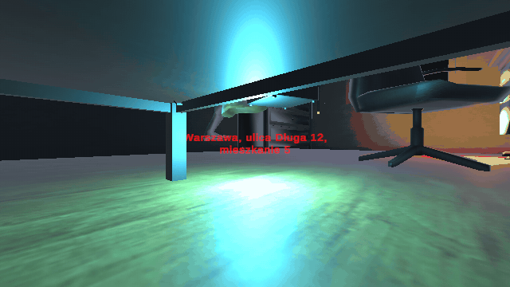
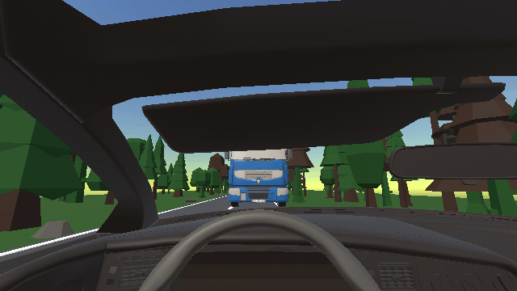
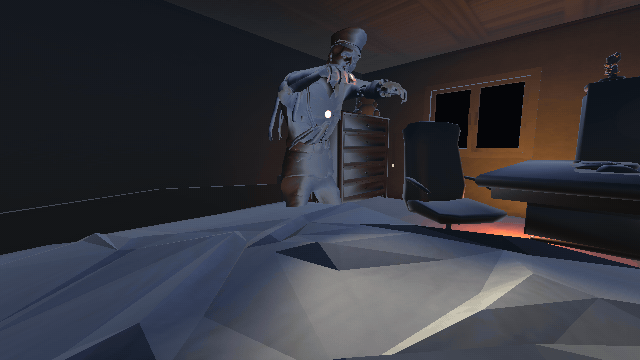
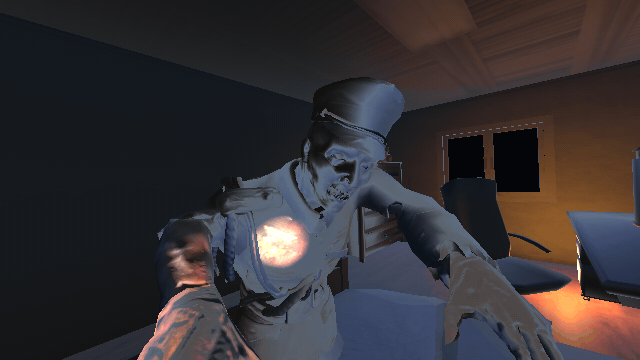

# CRISISREADY

**Treningowa gra Mixed Reality na Meta Quest 3/3S — bezpieczne ćwiczenie reakcji w sytuacjach kryzysowych w Twoim własnym pokoju.**

-000000?logo=unity&logoColor=white)


-3DDC84?logo=android&logoColor=white)


---

## Galeria

> GIF-y animują się bezpośrednio na GitHubie (oraz GIF-y nie oddają dobrze tekstur, które widać na goglach VR).






---

## O projekcie

**CRISISREADY** to gra treningowa Mixed Reality stworzona z myślą o nauce reagowania w sytuacjach kryzysowych. Dzięki technologii **passthrough** (prawdziwe MR — wirtualne obiekty pojawiają się na tle realnego otoczenia gracza, a nie w odciętym świecie VR) trening odbywa się w bezpiecznym, znajomym pomieszczeniu.

Gra jest sterowana **wyłącznie śledzeniem dłoni i głosem** — bez kontrolerów. Gracz przez całą sesję pozostaje w pozycji siedzącej i wchodzi w interakcję ze sceną naturalnymi gestami oraz mówieniem do mikrofonu.

Projekt powstał jako **akademicki projekt zaliczeniowy** (Grupa 1, Temat 3) i posiada wbudowaną **warstwę badawczą**: zdarzenia rozgrywki są zapisywane do dziennika `metrics.jsonl`, a po sesji uczestnicy wypełniają standaryzowane kwestionariusze (NASA-TLX, SUS, IPQ, UEQ) służące do oceny obciążenia poznawczego, użyteczności, poczucia obecności oraz doświadczenia użytkownika.

---

## Rozgrywka

Sesja to jedna ciągła historia. Przed właściwą grą gracz przechodzi krótki **trening** wprowadzający, po czym mierzy się z kolejnymi aktami.

### Trening — 3 ćwiczenia rozgrzewkowe

Zanim zacznie się fabuła, gracz oswaja się ze sterowaniem w trzech mikroćwiczeniach:

1. **Kierownica** — ćwiczenie ruchu dłońmi (skręt).
2. **Mowa** — ćwiczenie wypowiadania kwestii do mikrofonu.
3. **Cisza** — ćwiczenie zachowania ciszy przez wyznaczony czas.

### Akt II — „Poślizg”

Gracz prowadzi auto przez las. Samochód wpada w **poślizg** — trzeba odpowiednio **kontrować kierownicą** ruchem dłoni. Sekwencja kończy się **wypadkiem z ciężarówką**, po którym **dzwoni telefon**.



### Akt III — „Intruz”

Gracz **budzi się w sypialni** i orientuje się, że w domu jest intruz. Należy się **ukryć pod łóżkiem**, sięgnąć po **telefon leżący pod łóżkiem** i wykonać **zgłoszenie na numer 112**. Po drugiej stronie odpowiada **dyspozytorka (głos Pauliny, synteza mowy TTS)**. Następuje **45 sekund napięcia i ciszy**:

- Jeśli gracz dotrwa w ukryciu — słychać **syreny policji**: **wygrana**.
- Jeśli zostanie wykryty — następuje **jumpscare**: **porażka**.




---

## Sterowanie

Gra **nie używa kontrolerów**. Dostępne są dwa kanały interakcji:

| Kanał | Zastosowanie |
|-------|--------------|
| ✋ **Śledzenie dłoni** (hand tracking) | Obsługa menu, trzymanie i obracanie kierownicy, kontra w poślizgu, sięganie po telefon, chowanie się. |
| 🎤 **Mikrofon** | Wypowiadanie kwestii podczas rozmowy z dyspozytorem 112, ćwiczenie mowy oraz utrzymanie ciszy w Akcie III. |

> Gracz pozostaje **siedzący** przez całą sesję — wszystkie interakcje zaprojektowano jako gesty wykonywane na siedząco.

---

## Stack technologiczny

- **Silnik:** Unity 6 LTS — `6000.0.74f1`
- **Render:** Universal Render Pipeline (URP)
- **XR:** OpenXR + Meta XR SDK Core, hand tracking (`com.unity.xr.hands`), XR Interaction Toolkit
- **Passthrough:** tryb Mixed Reality (realne otoczenie + warstwa wirtualna)
- **Scripting backend:** IL2CPP, target **ARM64**
- **Platforma docelowa:** Android (Meta Quest 3 / 3S)
- **Rozpoznawanie mowy:** dyktowanie głosowe
- **Synteza mowy (TTS):** głos dyspozytorki „Paulina”
- **Pakiet aplikacji:** `com.grupa1.mrcrisistrainer` — firma `Grupa1_Temat3`, produkt `MRCrisisTrainer`
- **Warstwa badawcza:** logi zdarzeń `metrics.jsonl` + kwestionariusze (NASA-TLX, SUS, IPQ, UEQ)

> **Cała scena gry budowana jest z kodu.** Pomieszczenie i akty nie są ręcznie układane w edytorze — generuje je menu Unity **`MRCrisis → Build Lab Room Scene`** (skrypty `LabRoomBuilder` / `ActsBuilder` / `MetaSceneBuilder`). Po każdej zmianie w skryptach budujących scenę należy ją **przebudować**.

---

## Jak uruchomić / zbudować

W skrócie:

1. Otwórz projekt w **Unity 6 LTS (6000.0.74f1)**.
2. Zbuduj scenę gry: menu **`MRCrisis → Build Lab Room Scene`**.
3. Zbuduj APK: menu **`MRCrisis → Build APK (Quest 3)`** (skrypt `BuildScript`).
4. Wgraj gotowy plik **`Builds/MRCrisisTrainer.apk`** na zestaw Meta Quest 3 / 3S i uruchom (pamiętaj o zgodzie na śledzenie dłoni i dostęp do mikrofonu).

📖 Pełna, krok-po-kroku instrukcja: **[docs/INSTALL.md](docs/INSTALL.md)**.

---

## Struktura projektu

```
CRISISREADY/
├── Assets/
│   └── _Project/
│       ├── Audio/                  # dźwięki i nagrania (m.in. 112, TTS)
│       ├── Materials/              # materiały URP
│       ├── Models/                 # modele 3D (auto, sypialnia, łóżko…)
│       ├── Prefabs/                # prefaby sceny i UI
│       ├── Scenes/                 # bazowa scena (bakowana z kodu)
│       ├── ScriptableObjects/      # konfiguracje aktów i scenariuszy
│       ├── Textures/
│       └── Scripts/
│           ├── Core/               # zarządzanie sesją, stanem, audio, MR
│           ├── Acts/               # logika aktów (Act1 / Act2 / Act3)
│           ├── Gameplay/           # ScenarioRunner + detektory
│           ├── XR/                 # hand tracking, passthrough, pozy dłoni
│           ├── UI/                 # menu, HUD, podpowiedzi
│           ├── Research/           # kwestionariusze (NASA-TLX/SUS/IPQ/UEQ)
│           ├── Logging/            # zapis metrics.jsonl
│           └── Editor/             # budowniki sceny i APK (LabRoomBuilder, BuildScript…)
├── Builds/
│   └── MRCrisisTrainer.apk         # gotowy build na Quest
├── Packages/                       # zależności (OpenXR, Meta XR, XR Hands…)
├── ProjectSettings/
├── docs/                           # dokumentacja projektu
└── media/
    └── gifs/                       # materiały do README
```

---

## Zespół

| Osoba | Rola |
|-------|------|
| **Jakub Cieniuch** | Mechanika gry, integracja z Claude Code, testy |
| **Wiktoria Bartek** | Testy i feedback |
| **Oliwia Frueauff** | Scenariusze, formułki zgłoszenia 112 |
| **Magdalena Grzesiak** | Assety 3D i dźwięki |
| **Adriana Jankowiak** | Oprawa graficzna, kwestionariusze, analiza artykułu źródłowego, opracowanie sprawozdania |

---

## Dokumentacja

- 📄 **Sprawozdanie** (pełne, 37 stron) — [docs/CRISISREADY-sprawozdanie.docx](docs/CRISISREADY-sprawozdanie.docx) · [wersja PDF](docs/CRISISREADY-sprawozdanie.pdf)
- 🖥️ **Prezentacja** — [docs/CRISISREADY_prezentacja.pptx](docs/CRISISREADY_prezentacja.pptx)
- 🏗️ **Struktura projektu** — [docs/CRISISREADY_struktura.docx](docs/CRISISREADY_struktura.docx)
- ⚙️ **Instrukcja instalacji / budowania** — [docs/INSTALL.md](docs/INSTALL.md)
- 🖼️ **Zrzuty ekranu** — [docs/screenshots/](docs/screenshots)

---

## Licencja / uczelnia

Projekt **akademicki**, zrealizowany jako praca zaliczeniowa (**Grupa 1, Temat 3**). Materiał edukacyjny — udostępniany do celów dydaktycznych i demonstracyjnych.

🔗 Repozytorium: **https://github.com/JaySea-ML/CRISISREADY**
